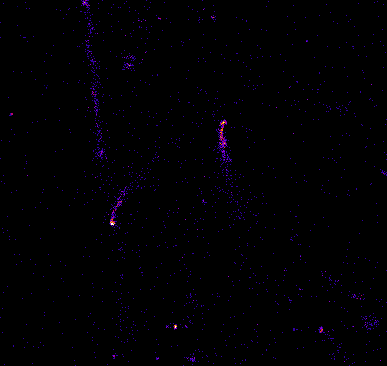
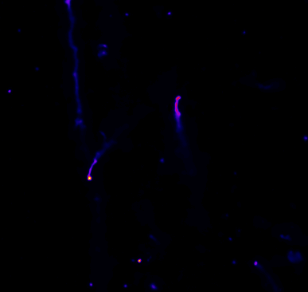

<h1 align="center">Terabyte scale image denoising using multiple nodes & multiple GPUs</h1>

<!-- ABOUT THE PROJECT -->
## About The Project

This repository contains Python based image denoising scripts using common CNN
architectures like Unet and its variations, RCAN, Inception etc. The primary focus
is to train a model from a limited training dataset (e.g. 3-5) and apply it to
very large multi-Terabyte 3D images (e.g. 100k x 100k pixels with thousands of slices)
using multiple GPUs on multiple nodes. A simple GUI is also provided to train/predict
small images.


## Overview
The following figure shows an example of a 3D noisy and denoised image. It has
been denoised using a 3D UNET using 64x64x16 patch size.

Noisy Image             |  Denoised Image
:-------------------------:|:-------------------------:
  |  

## Installation 

1. Libtiff is required to be installed. If root access is available, install
   libtiff-devel (```sudo yum install libtiff-devel```). If root access is
   not available, download the source from ```https://download.osgeo.org/libtiff/```. The
scripts are tested with libtiff 4.6.0 with GCC-11.3.0. Download tiff-4.6.0.zip, unzip, compile, and
After installing to a suitable location, add the lib folder to LD_LIBRARY_PATH and
the include folder to CPATH, e.g.,
```
export LD_LIBRARY_PATH=/home/user/libtiff/4.6.0/install/lib:${LD_LIBRARY_PATH}
export CPATH=/home/user/libtiff/4.6.0/install/include:${CPATH}
```

2. Create new python environment with tensorflow-gpu,
```
conda create -n myowncondaenv python==3.10
conda activate myowncondaenv
pip install tensorflow-gpu==2.11.0
pip install cython==0.29.36
pip install pytiff
pip install scikit-image==0.19.3
```
Then ```python Denoise_Train.py -h``` should show the help.

## Usage
### Training
